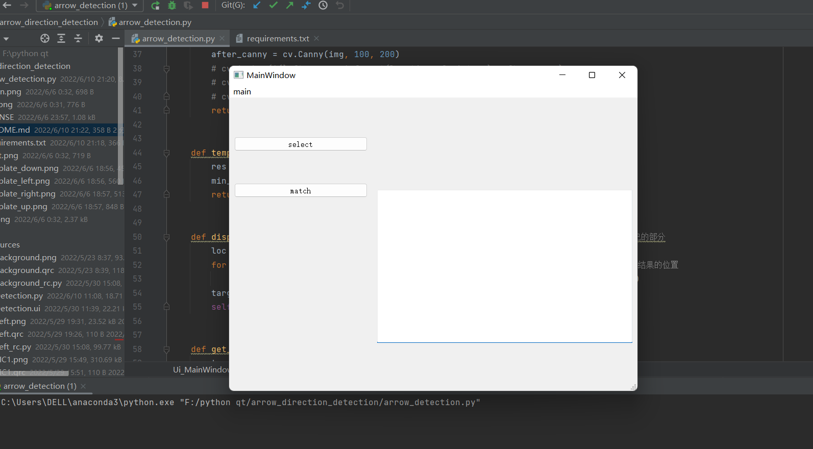
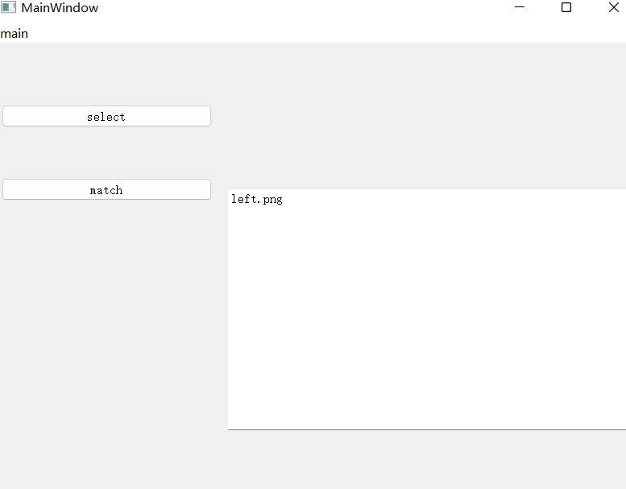
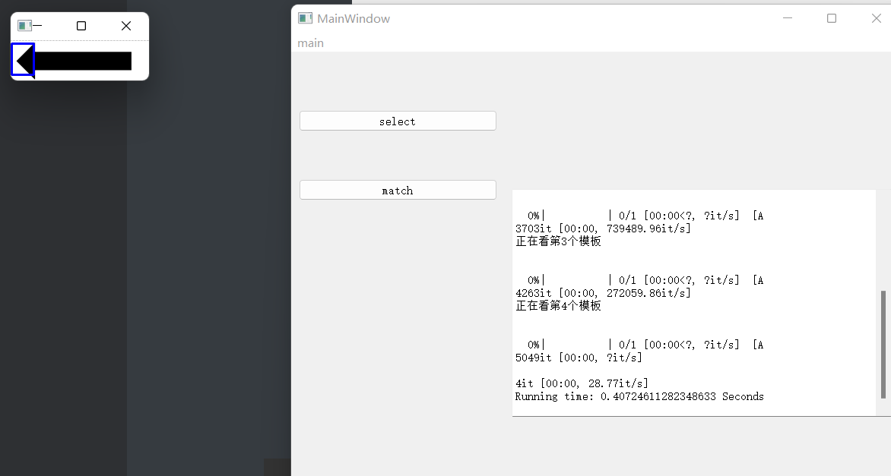
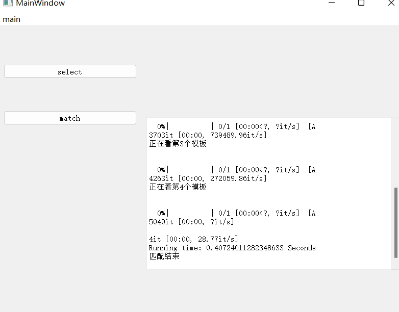

# README

**本项目升级之后，与GUI进行交互。**

**在运行之前首先检查并补充安装必要库**

```python
pip install -r requirements.txt
```

**之后运行程序**

```python
python arrow_detection.py
```

**出现图形界面**



**我们点击select，选择上下左右中的一个图片**

```python
up.png
down.png
right.png
left.png
```

**然后点击match**







**显示匹配过程中的信息，最终匹配结束。**


